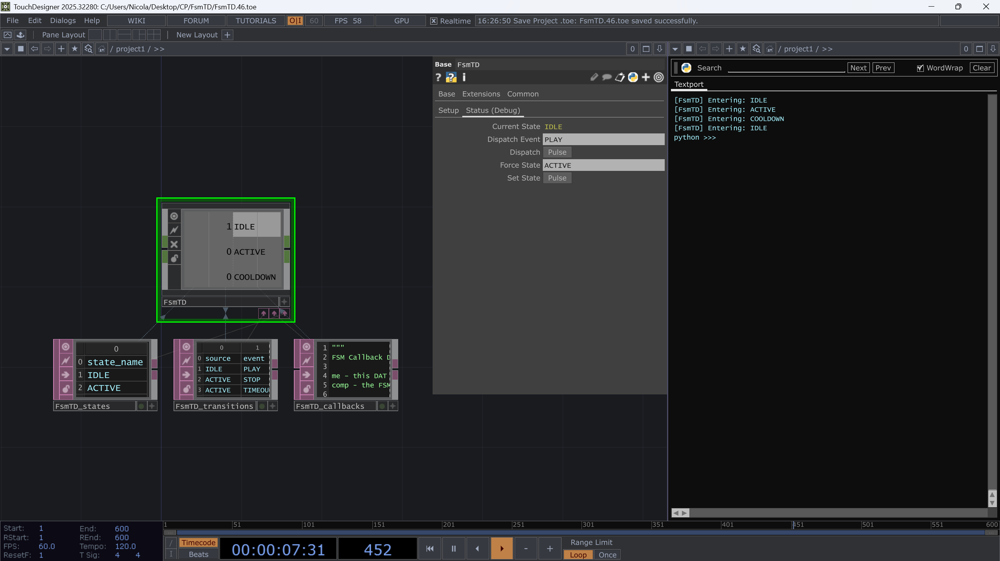

# TouchDesigner Data-Driven State Machine (FSM) 🚦

A robust, table-driven Finite State Machine component for TouchDesigner. 

Stop wrestling with complex webs of `Logic CHOPs` and spaghetti code. This `.tox` allows you to design bulletproof interactive logic using simple Table DATs, complete with built-in timers, CHOP I/O, and advanced Python callbacks.

## ✨ Features
* **Zero-Code Friendly:** Configure your entire logic flow visually using Table DATs.
* **Auto-Initializing:** Just drag and drop the `.tox` into your project. It automatically unpacks its configuration tables and wires itself up.
* **Built-in Timeouts:** Automate sequences (like attract loops or slideshows) directly from the transition table.
* **Native CHOP I/O:** Send events by simply naming your input CHOP channels. The FSM automatically outputs active states as `0` or `1` CHOP channels for effortless video/UI routing.
* **Python God-Mode:** Use the built-in Callback DAT to inject custom `onEntry`, `onExit`, and `onGuard` scripts for advanced hardware validation and API calls.
* **Debug UI:** Safely manually fire events and force states via the Custom Parameter page without needing physical sensors hooked up.

## 🚀 Quick Start
1. Download `FsmTD.tox`.
2. Drag and drop it into your TouchDesigner network.
3. Wait 1 frame! The component will automatically unpack its three docked configuration DATs (`states`, `transitions`, and `callbacks`).
4. Fill out your `states` and `transitions` tables.
5. Wire an input CHOP with channel names matching your Events, and use the output CHOP to drive your visuals!

## 🎓 The Example File
Not sure where to start? Download `Example.toe`. It contains 4 progressively advanced scenes:
* **Scene 1: The Stoplight** (Basic state routing)
* **Scene 2: The Auto-Slideshow** (Using timeouts for infinite loops)
* **Scene 3: The Media Player** (How the FSM ignores bad data and enforces rules)
* **Scene 4: The Smart Kiosk** (Branching paths, Python guards, and Admin overrides)

## 📖 Configuration Tables

### States Table
Requires a single column: `state_name`. List all possible states here.

### Transitions Table
Requires four columns: `source`, `event`, `target`, and `timeout`.
* `source`: The state you are leaving.
* `event`: The trigger required to leave.
* `target`: The destination state.
* `timeout`: (Optional) Float value in seconds. The FSM will automatically trigger the transition after this time elapses.

## 🤝 Contributing
Pull requests are welcome! If you build something cool with this, let me know and remember to mention us.  
If you like this project, please consider giving it a ⭐!

## 📄 License
[MIT License](LICENSE)